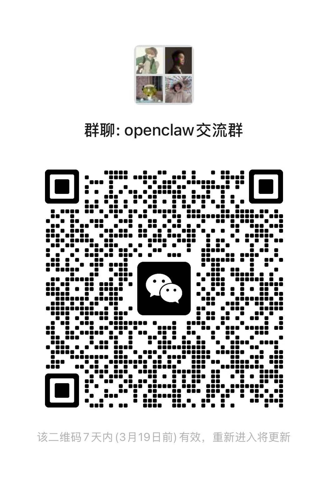

# Call Agents Help

> **Let your AI summon minions!** / **让你的 AI 召唤小弟！**

An open-source OpenClaw skill that lets your AI summon other AI bots into group chats for multi-agent discussions.

一个开源的 OpenClaw 技能，让你的 AI 在群聊中召唤其他 AI 机器人进行多智能体讨论。

---

## What is this? / 这是什么？

This is an OpenClaw skill that enables multi-agent discussions in Telegram groups. Your main AI (OpenClaw) can call other AI models (DeepSeek, Gemini, etc.) to join the conversation — each with its own persona, speaking through its own Telegram bot.

这是一个 OpenClaw 技能，可以在 Telegram 群里实现多 AI 讨论。你的主 AI（OpenClaw）可以召唤其他 AI 模型（DeepSeek、Gemini 等）加入对话——每个都有自己的人设，通过各自的 Telegram bot 发言。

**No need for multiple OpenClaw instances. No Docker. No complex setup.**

**不需要部署多个 OpenClaw，不需要 Docker，不需要复杂的环境配置。**

## Why? / 为什么做这个？

Normally, if you want two AIs to discuss a problem, you have to copy-paste messages between them like a human messenger. That's tedious, slow, and you lose context along the way.

通常情况下，如果你想让两个 AI 讨论一个问题，你得像信使一样在它们之间来回复制粘贴消息。这很累、很慢，而且上下文会丢失。

With this skill:

用了这个技能之后：

- Multiple AI bots discuss directly in a group chat / 多个 AI 机器人直接在群聊里讨论
- They challenge each other, catch errors, and converge on answers / 它们会互相质疑、纠错，最终收敛到一致的答案
- The entire conversation is visible to you in real time / 整个对话过程对你完全可视化
- You can interrupt, redirect, or ask follow-up questions anytime / 你可以随时打断、改变方向或追问
- Add as many bots as you want / 可以添加任意数量的 bot

## How it works / 工作原理

```
You (in Telegram group)
  │
  ▼
OpenClaw (main AI, e.g. 小龙虾)
  │  reads SKILL.md → runs deepseek_speak.py
  │  loads subsoul.md (persona identity)
  │  calls DeepSeek API
  │  sends response via helper bot
  ▼
Helper Bot (e.g. 批判派🔍) speaks in the same group
  │
  ▼
OpenClaw reads the response, replies, calls helper again...
  │
  ▼
Multi-round discussion until consensus or user stops it
```

The key insight: OpenClaw orchestrates everything. The helper bot is just a "mouth" — it doesn't need to run independently. This avoids the Telegram limitation where bots can't see each other's messages.

核心思路：OpenClaw 负责指挥一切。辅助 bot 只是一个"嘴"——它不需要独立运行。这样就绕开了 Telegram 中 bot 无法互相看到消息的限制。

## Quick Start / 快速开始

### Prerequisites / 前置条件

- A running [OpenClaw](https://github.com/nicepkg/openclaw) instance connected to Telegram
- A second Telegram bot token (create one via [@BotFather](https://t.me/BotFather))
- A [DeepSeek API key](https://platform.deepseek.com/) (cheap, ~$0.001/request)

### 1. Copy the skill / 复制技能

```bash
cp -r call-agents-help /path/to/your/openclaw/skills/
```

### 2. Configure environment variables / 配置环境变量

Add this to your `openclaw.json` under `skills.entries`:

在 `openclaw.json` 的 `skills.entries` 中添加：

```json
{
  "skills": {
    "entries": {
      "call-agents-help": {
        "env": {
          "DEEPSEEK_API_KEY": "your-deepseek-api-key",
          "DEEPSEEK_BOT_TOKEN": "your-telegram-bot-token"
        }
      }
    }
  }
}
```

### 3. Restart OpenClaw gateway / 重启 OpenClaw 网关

```bash
kill -9 $(pgrep -f openclaw-gateway)
sleep 2
openclaw gateway
```

### 4. Add both bots to a Telegram group / 把两个 bot 拉进同一个群

Add your main OpenClaw bot and the helper bot to the same Telegram group.

把你的 OpenClaw 主 bot 和辅助 bot 拉进同一个 Telegram 群。

### 5. Test it / 测试

Send a message to your main AI in the group:

在群里跟你的主 AI 说：

> 叫帮手来讨论一下：AI 会不会在五年内取代程序员？

Your main AI will share its opinion first, then summon the helper bot to respond. They'll go back and forth until they reach a conclusion (max 10 rounds).

你的主 AI 会先发表观点，然后召唤辅助 bot 回应。它们会来回讨论直到达成结论（最多 10 轮）。

## File Structure / 文件结构

```
call-agents-help/
├── README.md                 ← You're here / 你在这里
├── SKILL.md                  ← Skill definition (OpenClaw reads this) / 技能定义
├── subsoul.md                ← Helper bot persona / 辅助 bot 的人设档案
└── scripts/
    └── deepseek_speak.py     ← One-shot script (auto-loads subsoul.md) / 一次性脚本
```

## Customizing the Persona / 自定义人设

Edit `subsoul.md` to change the helper bot's personality. No code changes needed.

编辑 `subsoul.md` 即可修改辅助 bot 的性格，不需要改代码。

The default persona is "批判派🔍" — a calm, analytical thinker who looks at problems from different angles. You can make it anything: a creative brainstormer, a devil's advocate, a domain expert, etc.

默认人设是「批判派🔍」——一个冷静的分析型思考者，擅长从不同角度看问题。你可以改成任何角色：创意派、唱反调的、领域专家等。

## Adding More Bots / 添加更多 Bot

Want 3, 4, or 5 AIs discussing at once? Duplicate this skill with different personas:

想要 3 个、4 个甚至 5 个 AI 同时讨论？复制这个 skill 并改用不同的人设：

```bash
cp -r call-agents-help call-agents-creative
# Edit call-agents-creative/subsoul.md with a new persona
# Edit call-agents-creative/SKILL.md to update the name and triggers
# Add a new bot token in openclaw.json
```

You can even swap DeepSeek for other OpenAI-compatible APIs (Gemini, Claude, local models) by modifying the API endpoint in `deepseek_speak.py`.

你甚至可以把 DeepSeek 换成其他 OpenAI 兼容 API（Gemini、Claude、本地模型），只需修改 `deepseek_speak.py` 中的 API 端点。

## Debugging / 调试

### The helper bot doesn't respond in the group / 辅助 bot 在群里不说话

1. **Check BotFather privacy settings** / 检查 BotFather 隐私设置

   Go to @BotFather → `/setprivacy` → select your helper bot → `Disable`

   Note: This skill doesn't actually need the helper bot to *read* messages (OpenClaw handles that), but it's good practice.

2. **Check environment variables** / 检查环境变量

   ```bash
   # Test the script directly / 直接测试脚本
   DEEPSEEK_API_KEY="your-key" DEEPSEEK_BOT_TOKEN="your-token" \
   python3 scripts/deepseek_speak.py \
       --chat-id "your-group-chat-id" \
       --topic "test topic" \
       --no-telegram
   ```

   If `--no-telegram` works but regular mode doesn't, the issue is with the bot token or chat ID.

3. **Check the chat ID** / 检查群组 chat ID

   Group chat IDs are negative numbers (e.g., `-5176267683`). You can find yours by sending a message in the group and checking the OpenClaw logs.

### OpenClaw doesn't trigger the skill / OpenClaw 没有触发技能

1. **Check SKILL.md is in the right place** / 确认 SKILL.md 位置正确

   The skill folder should be inside your OpenClaw skills directory (usually `~/path-to-openclaw/skills/call-agents-help/`).

2. **Restart the gateway** / 重启网关

   ```bash
   kill -9 $(pgrep -f openclaw-gateway); sleep 2; openclaw gateway
   ```

3. **Try explicit trigger words** / 尝试明确的触发词

   Use phrases like "叫帮手", "让批判派来", "召唤助手" — these are defined in SKILL.md.

### DeepSeek API errors / DeepSeek API 报错

- **401 Unauthorized**: API key is wrong or expired / API key 错误或过期
- **429 Rate Limited**: Too many requests, wait a moment / 请求太频繁，稍等一下
- **5xx Server Error**: DeepSeek is having issues, the script will auto-retry once / DeepSeek 服务端问题，脚本会自动重试一次

### Testing without Telegram / 不通过 Telegram 测试

```bash
DEEPSEEK_API_KEY="your-key" \
python3 scripts/deepseek_speak.py \
    --chat-id "dummy" \
    --topic "人工智能的未来" \
    --context "有人说AI会取代所有工作" \
    --no-telegram
```

This will print the response to stdout without sending to Telegram. Useful for testing persona tweaks.

这会把回复打印到终端而不发送到 Telegram，方便测试人设调整。

## Limitations / 已知限制

- Telegram bots cannot see each other's messages — this is a platform limitation, which is why OpenClaw orchestrates everything / Telegram bot 之间无法互相看到消息——这是平台限制，所以由 OpenClaw 统一调度
- Context is managed by OpenClaw per-call, not persisted across sessions / 上下文由 OpenClaw 每次调用时传入，不跨会话保存
- Default max 10 discussion rounds to avoid runaway conversations / 默认最多 10 轮讨论，避免无限对话

## Roadmap / 路线图

This is v1 — it works, but there's room to grow. Upcoming improvements may include:

这是 v1 版本——能用，但还有优化空间。后续可能的改进方向：

- Smarter context management (auto-summarize long discussions) / 更智能的上下文管理（自动总结长讨论）
- Support for more AI providers out of the box / 开箱支持更多 AI 提供商
- Multi-platform support (Discord, Slack, etc.) / 多平台支持（Discord、Slack 等）
- Preset persona packs / 预设人设包

**Contributions welcome!** Feel free to fork this repo and build your own optimized version. If you come up with something cool, open a PR or share it with the community.

**欢迎贡献！** 随时 fork 这个仓库，做你自己的优化版本。如果你搞出了什么好玩的，欢迎提 PR 或者分享给社区。

## Community / 社区

Having trouble deploying or using this skill? Join our WeChat group for help and discussion:

部署或使用中遇到问题？加微信群交流：

<p align="center">
  
</p>

## License / 许可

MIT
